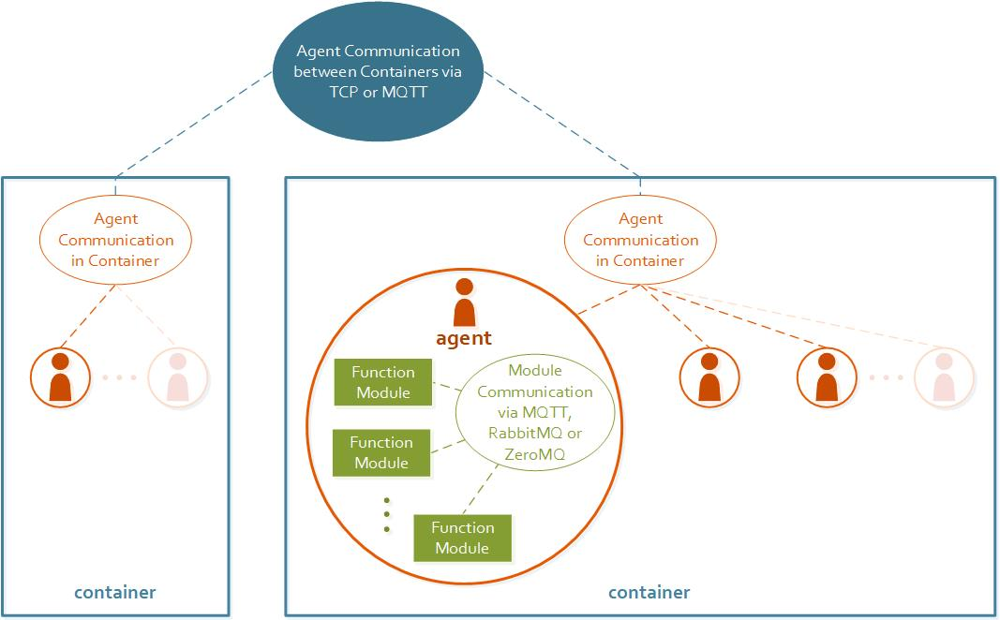

# Mango
**Modular Python Agent Framework**

**Note:** _This project is still in an early development stage. 
We appreciate constructive feedback and suggestions for improvement._


Mango is a python framework for multi-agent systems. 
It allows you to create agents with simple functionality with little effort,
 but also makes complex behavior through modularity easier to handle. 
 
Agents are able to exchange Messages via TCP or MQTT and can use different
codecs for message serialization. Messages based on the FIPA ACL standard are
supported

Figure 1 shows the different options mango offers. 
A container can host one or more agents. If an agents wants to send a message to
another agent, it must only know the other agents ID. The container will 
handle anything else. If the agent lives in the same container, the container
can handle the message exchange internally. Otherwise, the container forwards
the message to the host container of the target agent using either TCP or MQTT.
The protocol to be used is predefined and must be the same for all containers 
belonging to the multi-agent system.
If an agent must perform complex (and extensive) tasks, these can be 
distributed into individual function modules which can be loosely coupled. 
For this purpose MQTT, ZeroMQ or RabbitMQ can be used. 
In one agent, the same protocol must be used for message exchange between modules.
But different agents in one MAS can use different technologies internally.
Also, an agent does not hav to use function modules.
*Figure 1: basic functionality*


   
   

## Installation

Virtualenv:

```sh
pip install -r <YOURPATH>\mango\requirements.txt
pip install -e <YOURPATH>\mango
```

Requirements:
* We recommend python 3.8


## Usage example
Agents live in so called container. Container are used for message 
distribution. To create a container, the asynchronous factory method has to be called.
```python
    @classmethod
    async def factory(cls, *, connection_type: str = 'tcp', codec: str = 'json',
                      addr: Optional[Union[str, Tuple[str, int]]] = None,
                      log_level: int = logging.DEBUG, proto_msgs_module=None,
                      mqtt_kwargs: Dict[str, Any] = None):
        """
        This method is called to instantiate a container instance, either
        a TCPContainer or a MQTTCOntainer, depending on the parameter
        connection_type.
        :param connection_type: Defines the connection type. So far only 'tcp'
        or 'mqtt' are allowed
        :param codec: Defines the codec to use. So far only 'json' or
        'protobuf' are allowed
        :param addr: the address to use. If connection_type == 'tcp': it has
        to be a tuple of (host, port). If connection_type == 'mqtt' this can
        optionally define an inbox_topic that is used similarly than
        a tcp address.
        :param log_level: The log level to use
        :param mqtt_kwargs: If connection_type == 'mqtt':
        Dictionary of keyword arguments for connection to the broker. At least
        the keys 'broker_addr' and 'client_id' have to be included.
        Ignored if connection_type == 'tcp'
        :return: The instance of a MQTTContainer or a TCPContainer
        """
```

 For a container that communicates via tcp, the address to which the container 
is bound to has to be specified. Additionally the codec can be specified.
 Supported are json or protobuf (default is json). If protobuf is chosen,
 the protobuf message module (usually with a filename ending on '_pb2.py') 
 has to be provided.
 

```python
from mango.core.container import Container   
import my_messages_pb2      # module for the custom proto messages


async def tcp_example():
    # json_container
    json_tcp_container = await Container.factory(addr=('localhost', 5555))
    
    proto_tcp_container = await Container.factory(
        addr=('localhost', 5556),
        codec='protobuf',
        proto_msgs_module = my_messages_pb2
    )
    
    return json_tcp_container, proto_tcp_container
```

To create a container that communicates via MQTT, the connection_type has to be
changed to 'mqtt' and a dictionary with details regarding the broker address
and the chosen client_id has to be given.

Additionally an inbox topic can be provided by using the addr field.
 The inbox topic is used similarly to an address of a TCP container.
 The container will subscribe the inbox topic (no wildcards are allowed).

```python
from mango.core.container import Container
import my_messages_pb2      # module for the custom proto messages
    

async def mqtt_example():
    # json_container
    # assume a local broker is running on localhost:1883
    json_mqtt_container = await Container.factory(
        connection_type='mqtt',
        mqtt_kwargs={
            'broker_addr': ('localhost', 1883),
            'client_id': 'container_1'
            }
        )
    
    proto_mqtt_container = await Container.factory(
        connection_type='mqtt',
        mqtt_kwargs={
            'broker_addr': ('localhost', 1883),
            'client_id': 'container_1'
            },
        codec='protobuf',
        proto_msgs_module = my_messages_pb2
    )
    
    json_mqtt_container_with_inbox_topic = await Container.factory(
        connection_type='mqtt',
        mqtt_kwargs={
            'broker_addr': ('localhost', 1883),
            'client_id': 'container_1'
            },
        addr='my/inbox/topic',
        )
    
    return json_mqtt_container, proto_mqtt_container    
```

Agents can be implemented by inheriting from the abstract class Agent.
An instance of a container has to be provided.
 The class Agent provides
basic functionality such as to register the agent at the container or to 
constantly check the inbox for incoming messages.
Custom classes that inherit from Agent must implement the method 
handle_msg(self, content, meta: Dict[str, Any]).
Whenever a message for the agent arrives, this method is called with content
as the message content and meta as a dict of meta information.
```python
from mango.core.agent import Agent

class SimpleAgent(Agent):

    def __init__(self, container):
        super().__init__(container)

    def handle_msg(self, content, meta):
        # print the message
        print(f'{self._aid} received a message with content {content} and'
            f'meta {meta}')
```

To instantiate a SimpleAgent one has to first instantiate a container and then
the agent. In order to let a container and its agents run until all agents are
shutdown, one can await the parameter no_agent_running

```python
async def init_and_run_container_and_agent():
    container = await Container.factory(addr=('localhost', 5555))
    agent = SimpleAgent(container)
    await container._no_agents_running
```
So far we have instanciated a container and created and instanciated a custom agent class.
If we want to send a message to another agent, we can use the send_message method of the container:
```python
    async def send_message(self, content,
                           receiver_addr: Union[str, Tuple[str, int]], *,
                           receiver_id: Optional[str] = None,
                           create_acl: bool = False,
                           acl_metadata: Optional[Dict[str, Any]] = None,
                           mqtt_kwargs: Dict[str, Any] = None,
                           ):
        """
        container sends the message of one of its own agents to a specific topic
        :param content: The content of the message
        :param receiver_addr: In case of TCP this is a tuple of host, port
        In case of MQTT this is the topic to publish to.
        :param receiver_id: The agent id of the receiver
        :param create_acl: True if an acl message shall be created around the
        content.
        :param acl_metadata: metadata for the acl_header.
        Ignored if create_acl == False
        """
```

Lets make our SimpleAgent class a bit more complex by sending a message back to an agent once we receive a message:

```python
class SimpleAgent(Agent):

    def __init__(self, container):
        super().__init__(container)

    def handle_msg(self, content, meta):
        # print the message
        print(f'{self._aid} received a message with content {content} and'
            'meta {meta}')
        # get sender if possible
        sender_addr = meta.get('sender_addr', None)
        sender_id = meta.get('sender_id', None)
        if sender_addr and sender_id:
	        asyncio.create_task(self._container.send_message(
		        content='Thanks for your message',
		        receiver_addr=sender_addr,
		        receiver_id=sender_id,
		        create_acl=True
)
```
By setting create_acl, the container will wrap our content in an acl message and fill the types for sender. 
In that way, the receiving agent will receive useful meta information, such as we did by getting the sender_addr and the sender_id.

### Additional options for MQTT Container 
There are additional options for MQTT Container.
1. You can tell an MQTTContainer to subscribe topics for an agent by calling the containers method `subscribe_for_agent`:
```python
    async def subscribe_for_agent(self, *, aid: str, topic: str, qos: int = 0,
                                  expected_class=None) -> bool:
        """

        :param aid: aid of the corresponding agent
        :param topic: topic to subscribe (wildcards are allowed)
        :param qos: The quality of service for the subscription
        :param expected_class: The class to expect from the topic, default is ACL
        :return: A boolean signaling if subscription was true or not
        """
```
2. Usually a Container always expects ACLMessages. However, you can tell an MQTTContainer which  message classes it can expect at specific topics. This is either possible by setting the `ecpected_class` parameter when calling `subscribe_for_agent` or by calling the containers method `set_expected_class`.
The expected class should be included in the protobuf message module.
```python
    def set_expected_class(self, *, topic: str, expected_class):
        """
        Sets an expected class to a subscription
        wildcards are allowed here
        :param topic: The subscription
        :param expected_class: The expected class
        """	
```
However, if the codec is json, classes must have the method `encode()` and `decode()`.

## Meta

Please report bugs and ideas for improvement via mail at mango@offis.com

Distributed under the MIT license. 

## Release History

* 0.0.1
	* First TCPContainer with json
* 0.0.2
	* Added MQTTContainer and protobuf support  

